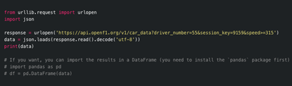

# CS 5610 Project Proposal

**Authors:** Sam Treadwell, Paul Adaimi, Rashaad Mirza  
**Date:** 2/29/2024

## Project Goal

Our web development project proposal is a complete redesign of the Formula 1 website. Currently, while this site is dynamic, functional, and user-friendly it lacks the visual appeal and wow factor that we intend on implementing. Our full-stack version named Fusion F1 is for the F1 fans and will be engaging, and include many creative components.

## Team

- **Paul**: Paul has 4 years of experience as a front-end developer and is proficient in React and 3D modeling and animations using Three.js among many other technologies.

- **Sam**: Sam started learning web dev starting last Halloween and knows HTML, CSS, JavaScript, jQuery, DOM, Bootstrap, and is learning back-end technologies including Express.js, Node.js, and Flask. He also has design experience in Adobe Photoshop, Dreamweaver, Figma, and Sketch.

- **Rashaad**: Rashaad has an undergraduate degree in Computer Science, he also has design experience and knows wireframing, UI design, and leveraging tools such as Figma.

Together, we aim to build a fully functional, fun, and appealing full-stack Formula 1 website.

Starting from the second day of class when the final project was mentioned, Sam started developing this site and has made progress in creating the following: Navbar, Drop-down menus in the navbar, Hover effects, Video embed, Carousel image slides, Articles section with obscured view for scrolling reveal (using overflow-y: auto;), as well as all the buttons and items found on the original [Formula 1 website](https://www.formula1.com/). This has been done using pure vanilla HTML, CSS, JavaScript, and Bootstrap [(MDB)](https://mdbootstrap.com/). All sources and works have been cited in a separate document.

## Architecture and Technical Requirements

Paul wants to migrate this project to React for scalability and ease of use. Sam and Rashaad are still learning React, JSX, and JSON. Ultimately, we also hope to include a back-end using the Flask blog tutorial for users to log in, create a profile, and contribute to a discussion board where they can interact with other fans.

Additionally, we found an API ([OpenF1](https://openf1.org/)) where we can leverage and visualize data (2018-2022) from race and championship standings, schedules, and starting grids.

Data includes: Car data, Drivers, Intervals, Laps, Location, Meetings, Pit, Position, Race control, Sessions, Stints, Team radio, Weather. Perhaps we can use Observable to visualize this data.

How the data is pulled with JavaScript:

How the data is pulled with Python:

Car Data:

This shows the functionality of the open-source API. Here is the abstract: 

“OpenF1 is a free and open-source API that provides real-time and historical Formula 1 data. The API offers a wealth of information, including lap timings, car telemetry, radio communications, and more. Whether you're looking to create interactive dashboards, dive deep into race analysis, or even develop connected objects that light up every time your favorite driver takes the lead, OpenF1 makes it all possible.

Data can be accessed in either JSON or CSV formats, making it user-friendly for both developers and non-developers alike. For a quick start, you can access the API through your web browser. A sample URL is provided for each method for easy reference.”

[OpenF1 API Website](https://openf1.org/)

## User Stories

Sam has consulted with other F1 fans including a friend from undergrad and faculty and students on campus (including Emma Peck Lishness, Dhanush Adithya Balamurugan) to ask for feedback and get a sense of what potential users of the web application are looking for. So far, users are looking for a dynamic application that is both informative and provides a seamless user experience. One user is specifically interested in the car build and underlying technology, so that will be included.

## UI Design

Rashaad will help with UI design, as he has the most design experience. This might include vector art, layout, transitions, and effects. Sam will ensure the whole product has design consistency. Paul’s 3D modeling experience in Three.js is useful for potentially implementing a 3D/VR experience:

[3D Model Link](https://sketchfab.com/3d-models/f1-mercedes-w13-concept-b9e85594aec847f78883343d67ee97fb)

## Project Management

Aside from the primary GitHub repository, the project is currently in GitLab as GitHub has a limit of 100 MB per project. Because of the embedded video and other large files the project currently occupies 1.4 GiB of project storage. If needed, we can remove large files and compress to make the 100 MB limit but if deployed we’d use all the necessary files.

## Work Plan

We have started to connect on Teams and plan to meet in person every Monday. Once Paul migrates the project to React, Sam and Rashaad will get debriefed on how to code in JSX and start implementing further functionality. Otherwise, Sam and Rashaad will manage the HTML, CSS, and JavaScript files that Paul will translate into the React framework. The team agrees that learning React is important and will make the code cleaner, more dynamic, and increase scalability.

## Acknowledgment

We fully acknowledge resources used and will include a “Works Cited” section on the navbar or footer that includes a comprehensive list of resources used with links. A disclaimer will accompany the resources that states we do not own the assets or intend on capitalizing on this project.

## Deployment

We will either deploy using GitHub Pages (if possible), or connect to a legitimate domain and include HTTPS and additional security.

Here is a peek at the latest version:

